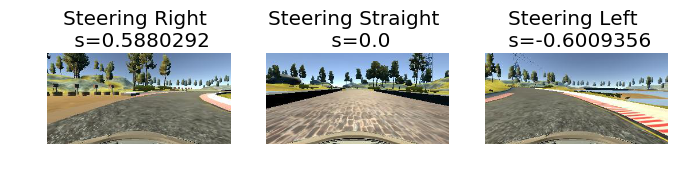
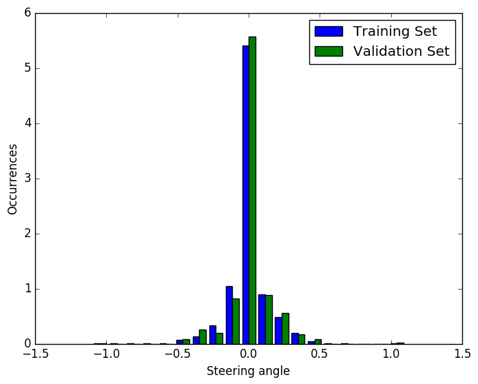

Overview
--------

This repository contains my solution for the Behavioral Cloning
Project of the Udacity Self-Driving Car Nanodegree.

It shows how to set up and train a convolutional neural network
that is capable of learning how to drive a car.

All Training and testing took place with Ubuntu 16.04 and the
beta version of the Udacity Self-Driving Car Simulator.

Outline
-------

1. Solution Design Process
2. Model Architecture
3. Training
4. Live Trainer
5. How to run the code
6. Summary
7. References

Solution Design Process
-----------------------

I started with the approach given in the Nvidia Papers [2] using Keras
to train and evaluate my model. <br />
The input images where transformed to YUV color space before pushing
them to the neural network for training. <br />
This model continuously decreased the MSE of the training and
validation set but applying it in the simulator did not show
promising results. <br />
Therefore I tried another approach used in the Comma.ai [1] project. <br />
Not only the MSE metrics quickly dropped down with this simpler
model structure but also the simulator was able to (almost) manage
the first corner. <br />
That's why I sticked with this approach. I altered it by adding the
the R channel of the RGB image to the color space as the model
had some problems learning the sharp left and right corners with
red-white curbs. <br />
Additional I applied a ROI mainly reducing the height of the image
as the top region give no important information for driving.
This reduced the complexity of the model and decreased training and
execution time.


Model Architecture
------------------

As stated earlier the model was inspired by the approach of the
Comma.ai [1] project.
It uses images of size 200x66 with 4 channels (YUV + R(ed) channel)
as input. Before applying the convolutional layers the input
is normalized within the network. <br />
The first layer consists of convolutional layer with 16 8x8 kernels and
an exponential linear unit (ELU) applied to output. <br />
The second layer is quite similar with 32 5x5 kernels and an ELU. <br />
The third layer has 64 5x5 kernels.
Its output of this layer is flattened and dropout with a keep
probability of 0.2 is applied before using a ELU for activation. <br />
This output is pushed to a single dense layer with 512 neurons, dropout
of 0.5 and another ELU. <br />
This layer is connected to the output layer giving us the
control request.

Training
--------

 <br />

Initially the model was trained using the dataset provided by Udacity.
I used an Adam Optimizer with a decreased learning rate of 0.00001
compared to the default settings.<br />
Training was done on 5 epochs of the training data with only 5% of the
data used for validation. This low number was chosen as the metric (MSE)
does not really provide a good measurement of the how the model will
perform in the simulator. <br />
The distribution of training and validation samples shows that most
of the data suggest a "straight" steering. With this training data
the model will show a bias in this direction. Additional training
data will be necessary and will be recorded "live". <br />

 <br />

With this training the car was able to drive to the first left turn but
could not take it. <br />

Live Trainer
------------

 <br />

Training with the Udacity dataset already gave a model
Compared to the solutions


&nbsp;&nbsp;The left stick was used to control the car in
the left and right direction. Speed cannot by controlled
in the current version and is set directly (Cruise Control). <br />


&nbsp;&nbsp;While driving autonomously pressing the A button
disables the automatic control and let you drive the car using the
game pad. Pressing this button in this mode again trains the model
with the data collect since manual take-over. <br />


&nbsp;&nbsp;This button also switches to manual control. But compared
to A you won't train the model when switching back to autonomous
mode. <br />


&nbsp;&nbsp;This button can be used to reset the low pass filter
for steering to zero. This helps to quickly restore a straight
driving with steering angle 0. <br />

The training took place with lowered learning rate of 0.000001 and
did not further split the training set into e.g. a validation set
as the MSE did not prove to be a good measurement and effects of
training could be seen directly in the simulator. <br />
While training the previous control approach is still
send to the simulator. This might cause the vehicle to leave the road
and crash. I only used very short sequence to refine the model
that's why this was not a problem when using the live trainer
on my model. <br />
In general the training should run in a separate threat to avoid
this behavior.

How to run the code
-------------------

This repo consists of 3 executable python files (model.py, drive.py
and live_trainer.py).

Start training and provide the path to the training set (in this case
data)
```
python3 model.py -t data
```

The training has several options. Only the first once is mandatory.
The others are set to a default value if they are not passed. <br />
-n Number of epochs used for training (Default: 5) <br />
-a Use additional data, in this case left and right images (Default: 0/Off) <br />
-l Load model with weights from model.json instead of starting from
scratch <br />
```
python3 model.py -t data -n 5 -a 0 -l 0
```

Start the server to control the simulator using the previously stored
model.json.
```
python3 drive.py model.json
```

Start the live trainer with model save under model.json. This model will
also be updated.
```
python3 live_trainer.py model.json
```

Summary
-------

The model generated by this approach is capable of driving the
trained track quite well. It is sometimes a bit shaky due to
the but in the end it recovers quite well. <br />
It was quite exiting to see the live training showing effect.
E.g. the model used to crash in some corners. After training
it with sequences of manually driving this scenario it improved
more and more until it finally almost copied my "racing line". <br />
Further it was interesting to see that the recovery training on the
bridge resulted in something similar to a PID controller, which
takes the car back to the center of the lane for almost any starting
position. <br />
This project also showed to me that it is very important to have a short
iterations between training and validation and a good measurement
of your model performance.
Without applying the live_trainer approach I think it is very
difficult to train a good model without an indefinite number of
tries.

References
----------

[1] http://comma.ai <br />
[2] https://images.nvidia.com/content/tegra/automotive/images/2016/solutions/pdf/end-to-end-dl-using-px.pdf <br />
[3] https://upload.wikimedia.org/wikipedia/commons/4/4d/Xbox-360-Wireless-Controller-White.jpg <br />
[4] http://opengameart.org/content/free-keyboard-and-controllers-prompts-pack <br />
[5] https://medium.com/@tantony/training-a-neural-network-in-real-time-to-control-a-self-driving-car-9ee5654978b7#.pvhsgzl4i <br />